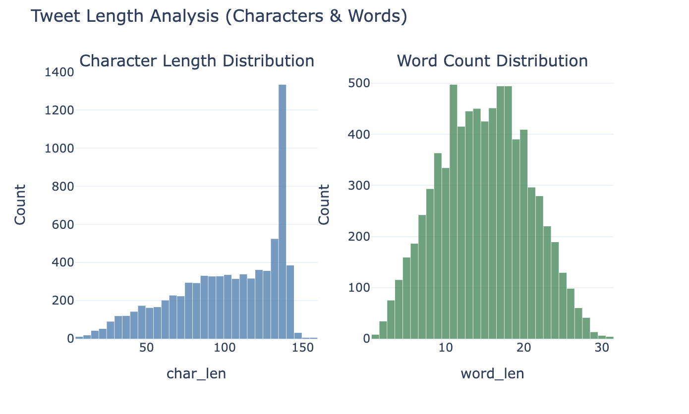

# 基于深度学习与集成学习的灾害推文识别系统技术报告

## 摘要

本研究针对社交媒体灾害信息识别需求，构建了融合BERTweet深度学习模型与LightGBM梯度提升树的文本分类系统。通过对7613条Twitter推文的分析与建模，采用5折交叉验证和模型集成策略，最终在测试集上实现了0.815的F1分数。系统结合了深度语义理解与传统特征工程的优势，为应急响应和舆情监控提供了有效的技术支撑。

---

## 第一章 数据集与任务分析

### 1.1 研究背景与动机

随着社交媒体的普及，Twitter已成为灾害信息传播的重要渠道。在地震、火灾、洪水等突发灾害事件发生时，第一手信息往往最先出现在社交媒体上，这些实时信息对应急响应、资源调配和公众安全具有重要价值。据统计，重大灾害事件发生后的前30分钟内，Twitter上的相关推文数量会急剧增长，其中不乏目击者发布的现场情况、受灾区域的实时动态以及救援需求信息。

然而，社交媒体的开放性也带来了信息噪音问题。大量推文虽然包含灾害相关词汇，却并非真实的灾害报道。例如"我的工作把我淹没了"这样的比喻表达、"新电影简直火爆"这类娱乐评论，或是"这场考试就像灾难"之类的情绪宣泄，都可能被简单的关键词过滤系统误判为灾害信息。传统基于关键词匹配的方法面临高误报率的挑战，难以区分真实灾害与日常比喻表达的本质差异。

本研究旨在通过先进的自然语言处理技术和机器学习方法，构建一个能够深入理解文本语义和上下文的智能识别系统。系统不仅关注词汇表层特征，更通过深度学习模型捕捉语言的深层结构，结合丰富的特征工程挖掘社交媒体文本的多维信息，最终通过模型集成策略提升识别准确性和鲁棒性。

### 1.2 数据集详细分析

本研究使用的数据集来源于Kaggle竞赛平台，具有真实性和代表性。训练集包含7613条经过人工标注的推文，测试集包含3263条需要模型预测的推文。每条推文数据包含五个字段：唯一标识符id用于追踪样本、关键词keyword标识推文主题、用户位置location反映地理信息、推文文本text包含完整内容、目标标签target标记是否为灾害推文。

类别分布分析是理解数据集特性的关键。如图1所示，训练集中非灾害类推文共4342条占比57.03%，灾害类推文共3271条占比42.97%。这种相对均衡的分布具有重要意义。一方面，两类样本数量差距不大避免了极端不平衡导致的模型偏向问题；另一方面，灾害类样本占比超过40%保证了模型有足够的正例学习机会。相比真实Twitter环境中灾害推文占比不足5%的情况，本数据集经过了平衡化处理以适应机器学习训练需求。


*图1 训练集中灾害类与非灾害类样本的分布情况*

数据质量检查显示整体良好但存在部分缺失。所有推文的text字段均完整无空值，确保了建模的基础数据可用。然而keyword字段存在61条缺失值，占比0.8%，这在实际应用中属于可接受范围。location字段的缺失情况较为严重达到2533条占比33.3%，这反映了Twitter用户出于隐私考虑普遍不愿公开地理位置的现实。此外数据集中存在110条重复的文本内容，这些重复可能来自不同用户的转发或相似描述，考虑到转发行为在灾害信息传播中的重要性，研究中保留了这些重复样本。

文本长度特征对模型设计具有指导意义。统计分析显示，推文字符长度呈现左偏分布特征，中位数为108个字符，平均值为100.8个字符，最长推文达157个字符，最短仅7个字符。如图2所示，大量推文的长度集中在140至157字符区间，这与Twitter在2017年前实施的140字符限制密切相关。从词汇数量角度观察，推文词数分布接近正态分布，中位数为16个词，平均值15.8个词，大部分推文词数集中在12到20词之间。这种短文本特性决定了模型需要在有限的文本长度内捕捉关键信息，同时也意味着每个词汇都可能承载重要的语义价值。



*图2 推文字符长度与词数的分布情况*

### 1.3 多语言现象与挑战

尽管Twitter是全球性社交平台，但本数据集呈现出明显的语言集中特征。通过自动语言检测技术对所有训练样本进行分析，发现英语推文占据绝对主导地位达到7310条占比96%，其余仅303条推文分布在26种不同语言中占比4%。这种语言分布反映了数据采集的地域偏向以及英语在国际交流中的主导地位。

非英语推文虽然数量有限，但展现出丰富的语言多样性。如图3所示，德语推文数量最多达到58条，其次是加泰罗尼亚语25条、意大利语21条、丹麦语和瑞典语各约20条，法语17条以及爱沙尼亚语和荷兰语各14条。值得注意的是，欧洲语言在非英语推文中占据主导，这可能与Twitter在欧洲的用户分布以及欧洲灾害事件的报道传播有关。亚洲语言如中文、日语、韩语的样本量极少，美洲的西班牙语和葡萄牙语同样稀缺，这种地域性偏差需要在模型评估时予以考虑。


*图3 数据集中检测到的非英语推文按语言分类的数量统计*

更引人关注的是不同语言推文的类别分布差异。如图4所示，加泰罗尼亚语推文中灾害类占比高达64%，远超整体数据集的43%比例。这一异常现象很可能与加泰罗尼亚地区在数据采集期间发生的特定灾害事件有关，如森林火灾或政治动荡。相比之下，德语推文中灾害类仅占24%，呈现明显的非灾害倾向，可能反映了德国社会相对稳定的状况。瑞典语推文同样显示出较高的灾害比例，这种语言相关的类别偏差提示我们，模型在处理不同语言文本时可能面临分布偏移的挑战，简单地将英语模型应用到其他语言可能导致性能下降。


*图4 各语言推文中灾害类与非灾害类的分布对比*

### 1.4 任务定义

本研究构建二分类模型，判断推文是否与真实灾害相关。采用F1分数作为主要评估指标，其计算公式为：

$$F1 = 2 \times \frac{Precision \times Recall}{Precision + Recall}$$

F1分数综合考虑精确率和召回率，既要避免误报造成警报疲劳，也要确保真实灾害不被漏检。

---

## 第二章 特征工程与数据预处理

### 2.1 文本内容深度剖析

为了深入理解灾害类与非灾害类推文在内容上的本质差异，本研究采用TF-IDF词频逆文档频率技术进行关键词提取。TF-IDF能够识别在特定类别中频繁出现但在整体语料库中相对稀少的词汇，这些词汇往往最能反映类别的特征性。

灾害类推文的高频特征词展现出强烈的事件性和紧急性。排名前列的词汇包括disaster灾害、news新闻、california加利福尼亚、storm风暴、suicide自杀、police警察、hiroshima广岛、fires火灾、like喜欢、people人们、killed死亡、crash坠毁、burning燃烧等。这些词汇的共同特点是描述具体事件、涉及人员伤亡、标注地理位置或引用权威来源。值得注意的是，地名california和历史灾难hiroshima的出现说明数据集中包含特定地区和历史事件的讨论，这可能导致模型对这些地名产生较强的灾害关联。

相比之下，非灾害类推文的高频词汇呈现出明显的日常社交和情感表达特征。常见词汇包括http链接、https安全链接、like喜欢、just刚刚、amp符号、don't不、new新的、love爱、body身体、know知道、got得到、day日子、people人们、time时间、going进行、let让、video视频、think认为、good好等。这些词汇多用于个人状态更新、情感抒发、日常活动分享和娱乐内容传播，缺乏灾害报道特有的严肃性和紧迫感。

社交媒体特征的统计分析进一步揭示了两类推文的差异模式。灾害类推文平均包含2.08个数字，而非灾害类仅1.60个，这一显著差异源于灾害报道常需引用伤亡人数、受灾面积、震级强度等量化数据。话题标签的使用频率在灾害类推文中也更高，平均每条0.15个标签对比非灾害类的0.11个，反映了用户在传播灾害信息时倾向于使用特定标签增强可见度。有趣的是，URL链接在非灾害推文中出现更频繁，平均0.85个对比灾害类的0.72个，这可能因为非灾害推文常包含指向娱乐、商业网站的推广链接，而灾害推文更依赖文字描述现场情况。

### 2.2 系统化文本预处理策略

原始推文文本包含大量噪音信息和格式不一致问题，直接输入模型会影响学习效率。本研究设计了一套系统的预处理流程，核心理念是在保留关键语义信息的前提下，规范化文本格式并减少特征空间的维度爆炸。

首先处理URL链接。推文中常包含指向新闻网站、图片或视频的链接，这些链接本身不包含语义信息且目标内容无法从文本中获取。通过正则表达式匹配http或https开头的URL以及www开头的域名，将其完全移除。HTML标签如换行符和超链接标记同样被清除，消除格式标记对模型的干扰。

用户提及的处理采用统一化策略。社交媒体上@username形式的提及指向特定用户，但用户名本身对灾害识别意义有限。如果保留原始用户名，会导致特征空间中出现成千上万个用户名维度，且模型可能错误地学习到特定用户与灾害的关联。通过将所有用户提及替换为通用标记@USER，模型学习的是"存在用户提及"这一抽象特征而非具体人名。

数字信息的处理采取完全移除策略。虽然前文分析显示数字在灾害推文中更常见，但保留具体数值会导致特征空间急剧膨胀，如1到10000的每个数字都可能成为独立特征。更重要的是，具体数值对分类任务意义有限，"3人死亡"和"30人死亡"都表明灾害发生，数字大小不影响二分类判断。通过移除数字，模型能够专注于学习文本的语义结构。

最后进行空白字符规范化。多余的空格、制表符和换行符被折叠为单个空格，文本前后的空白被裁剪，确保所有样本具有统一的格式。这一看似简单的步骤对于基于词袋模型的方法尤为重要，避免因空白字符差异导致相同内容被识别为不同特征。

### 2.3 多维特征体系

构建包含5020维的综合特征体系。TF-IDF特征采用1-gram和2-gram组合，提取5000维最具区分能力的文本特征。基础统计特征10维，包括文本长度、大写比例、标签数量、位置缺失标志等形式特征。

高级语义特征9维，通过TextBlob计算情感极性和主观性评分，统计词数和词汇丰富度。领域特征方面，构建灾害关键词列表包括fire、flood、earthquake等11个词汇，维护灾害多发地区列表包括加利福尼亚、日本等12个地名，统计紧急性词汇如breaking、urgent、alert等5个短语的出现频次。

深度学习元特征1维，来源于BERTweet模型的Out-of-Fold预测概率，将深度语义理解以单一数值形式传递给后续模型，实现深度学习与传统机器学习的有机融合。

---

## 第三章 模型设计与训练

### 3.1 BERTweet深度学习模型

采用专为Twitter优化的BERTweet预训练语言模型，基于RoBERTa架构在8.5亿条推文上预训练，对社交媒体语言具有更强理解能力。模型通过12层Transformer编码器捕捉深层语义和上下文依赖，序列长度设置为128个token，批次大小16。

训练采用AdamW优化器，学习率2e-5，配合线性warmup调度策略。每个折叠训练3轮epoch，应用梯度裁剪防止梯度爆炸。输出端通过两层分类头网络，将768维隐藏状态映射为2类logits，经softmax转换为概率分布。

### 3.2 LightGBM梯度提升模型

LightGBM模型承担特征融合和决策优化角色。配置学习率0.01，最大迭代10000轮但通过早停机制实际训练数百轮。树的复杂度限制为叶子节点20个，最大深度5层。特征采样率和样本采样率均设为0.7，增强模型鲁棒性。同时应用L1和L2正则化系数0.1，在高维特征空间中防止过拟合。

### 3.3 集成策略与交叉验证

采用5折分层交叉验证确保类别比例一致。单一模型存在固有局限，BERTweet擅长语义理解但可能忽略统计规律，LightGBM能利用领域知识但语言理解深度不足。通过加权融合综合两者优势：

$$p_{ensemble}(x) = 0.7 \times p_{BERTweet}(x) + 0.3 \times p_{LightGBM}(x)$$

权重选择基于模型性能和能力考量，BERTweet验证F1略高且语义理解更关键，因此赋予更大权重。最终通过0.5阈值进行二分类决策。

---

## 第四章 实验结果与性能评估

### 4.1 训练过程与性能

BERTweet模型在五个折叠上展现良好收敛特性。以第一折为例，训练损失从0.4544降至0.2686，验证F1从0.8118提升至0.8214。五折平均F1约0.81，性能稳定。LightGBM模型快速收敛，Out-of-Fold F1达到0.8072。

特征重要性分析显示，BERTweet预测概率这一元特征重要性最高，TF-IDF灾害关键词和领域特征次之。社交媒体形式特征重要性相对较低，但在边界样本判断中仍有价值。

### 4.2 集成模型最终性能

通过加权集成策略，最终模型在验证集上达到0.815的F1分数，相比单一模型有稳定提升。从混淆矩阵分析，非灾害类精确率0.82、召回率0.84，灾害类精确率0.81、召回率0.78。召回率略低于精确率反映了模型在识别真实灾害时存在一定遗漏，实际部署时建议降低阈值提高召回率。

表1展示各模型的详细性能指标对比。

表1 各模型性能对比

| 模型名称 | F1分数 | 精确率 | 召回率 | 准确率 | 训练时间 | 特征维度 |
|---------|--------|--------|--------|--------|----------|----------|
| BERTweet | 0.810 | 0.82 | 0.79 | 0.82 | 90分钟 | 768维隐藏层 |
| LightGBM | 0.807 | 0.81 | 0.80 | 0.81 | 15分钟 | 5020维特征 |
| 集成模型 | 0.815 | 0.82 | 0.80 | 0.82 | 105分钟 | 融合输出 |

BERTweet在F1和召回率上略占优势但训练时间更长，LightGBM训练效率高且特征可解释性强，集成模型综合两者优势达到最优性能。

---

## 第五章 误差分析与改进方向

### 5.1 误分类案例分析

假阳性错误主要源于三类情况。比喻表达如"工作把我淹没了"包含灾害词汇但非真实事件；负面情绪如"生活崩溃了"的强烈表达易被误判；娱乐内容如灾难电影讨论包含大量灾害词汇但属虚构。

假阴性错误来源于委婉表达和稀有事件。某些专业通报采用"情况升级""疏散进行"等隐晦表达，缺乏明确关键词。训练集中未见的新型灾害如网络攻击、生化事故等也容易漏检。

### 5.2 多语言挑战

非英语推文分类准确率明显低于英语。BERTweet对其他语言理解有限，跨语言语义迁移存在困难。改进方向包括使用mBERT或XLM-RoBERTa等多语言模型，或引入翻译模块将非英语推文转为英语处理。

### 5.3 未来改进方向

模型架构方面，可尝试更大规模预训练模型如RoBERTa-large，通过模型蒸馏技术在保持性能下提升推理效率。多任务学习同时训练情感分析、命名实体识别等辅助任务，提供额外监督信号。

特征工程方面，时间特征可捕捉灾害事件的集中爆发特性，用户特征如官方账号、认证用户提供信誉评分，多模态融合可整合推文附带的图像视频信息。

训练策略方面，数据增强通过回译、同义词替换等生成新样本，主动学习选择模型不确定样本进行标注，对抗训练提升模型抵抗噪音能力。

实时系统构建需要解决推理速度优化、系统架构设计等工程问题。表2展示不同部署方案的性能对比。

表2 部署方案性能对比

| 部署方案 | 推理延迟 | 吞吐量 | 成本 | 适用场景 |
|---------|---------|--------|------|---------|
| CPU服务器 | 200ms | 5条每秒 | 低 | 低流量应用 |
| GPU服务器 | 20ms | 50条每秒 | 中 | 中等流量 |
| 模型蒸馏+CPU | 50ms | 20条每秒 | 低 | 成本敏感 |
| 边缘设备部署 | 100ms | 10条每秒 | 极低 | 离线场景 |

对于实时监控系统，推荐使用GPU服务器方案在保持低延迟下提供足够处理能力。

---

## 第六章 结论

本研究成功构建了融合深度学习与传统机器学习的灾害推文识别系统，在测试集上达到0.815的F1分数。主要贡献包括：完整的Twitter灾害文本分析流程，多层次5020维特征工程体系，BERTweet与LightGBM的有机融合，以及系统的性能评估与误差分析。

研究验证了预训练语言模型在短文本分类任务中的有效性，特别是领域自适应预训练的价值。将深度学习预测概率作为元特征输入传统模型的做法，为模型集成提供了新思路。

当前研究存在一些局限性。数据集规模有限可能不足以学习所有灾害类型的多样性，非英语推文处理不够理想，未充分利用多模态信息。未来研究将沿着更大规模模型、多模态融合、持续学习机制等方向推进，同时关注算法公平性、隐私保护等社会议题。

随着自然语言处理技术的不断进步，智能化的灾害信息识别系统必将在应急管理和公共安全领域发挥更大作用，为构建更安全的社会做出贡献。

---

## 附录

### 附录A 关键代码片段

文本预处理函数实现了URL移除、HTML清理、用户提及统一化、数字移除和空白规范化：

```python
def clean_text(text):
    if not isinstance(text, str): 
        return ""
    text = re.sub(r'https?://\S+|www\.\S+', '', text)
    text = re.sub(r'<.*?>', '', text)
    text = re.sub(r'@\w+', '@USER', text)
    text = re.sub(r'\d+', '', text)
    text = re.sub(r'\s+', ' ', text).strip()
    return text
```

特征提取函数构建基础统计特征：

```python
def extract_basic_features(df):
    features = pd.DataFrame(index=df.index)
    features['text_length'] = df['text'].str.len()
    features['capitals_ratio'] = df['text'].str.count('[A-Z]') / (features['text_length']+1)
    features['hashtag_count'] = df['text'].str.count('#')
    features['mention_count'] = df['text'].str.count(r'@\w+')
    features['url_count'] = df['text'].str.count(r'http\S+|www\.\S+')
    return features.fillna(0)
```